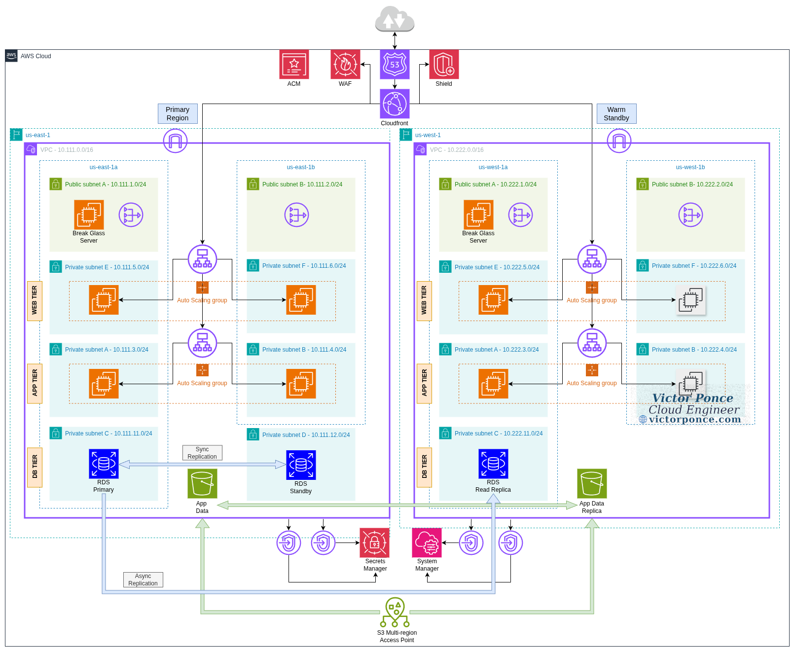

# Project: Multi-Region High Availability & Disaster Recovery Architecture (Warm Standby)
**Author:** Victor Ponce | **Contact:** [Linkedin](https://www.linkedin.com/in/victorhugoponce) | **Website:** [victorponce.com](https://victorponce.com)

**Versión en Español:** [README.es.md](https://github.com/victorhponcec/portfolio-network-security/blob/main/README.es.md)

---

## 1. Overview

This project presents a **multi-region, highly available, warm-standby architecture on AWS**, fully automated with Terraform.  
The goal is to provide a **production-grade disaster recovery (DR) design**, ensuring application continuity even in the event of a full regional outage.

The solution uses **Region A (Primary)** and **Region B (Standby)** with synchronized infrastructure, cross-region replication, CloudFront origin failover, and multi-region data resilience.  

---

## 2. Architecture Diagram

**(img. 1 – Multi-Region Warm Standby Architecture)**

---

## 3. Infrastructure Overview

The infrastructure is deployed across **two AWS regions** to support warm standby:

- **Region A (Primary):** Handles 100% of production traffic  
- **Region B (Standby):** Runs a scaled-down copy of the infrastructure, ready to scale during failover  
- Failover is performed automatically at the **edge (CloudFront)** and manually/automatically at the **database layer** (We can also automate the failover of the database by using Aurora, which comes at a higher cost than the RDS solution I proposed)
- You can review the 3-tier application architecture in detail in my other project: [Project: Securing a 3-tier application](https://github.com/victorhponcec/portfolio-aws-security-1)

The core components include:

### **Global Edge Layer**
- Amazon CloudFront  
- AWS WAF  
- ACM global certificates  
- Origin failover to regional ALBs (Primary to Standby)

### **Regional Application Infrastructure**
Each region contains:

| Tier       | Subnets / AZs                                                | Resources                                                                 | Purpose |
|------------|--------------------------------------------------------------|---------------------------------------------------------------------------|---------|
| **Web**    | Public Subnets A/B                                           | Internet-facing ALB, Auto Scaling Group (reduced size in standby region) | Entry point for CloudFront |
| **App**    | Private Subnets A/B                                          | Internal ALB, Auto Scaling Group                                         | Business logic processing |
| **Database** | Private Subnets C/D                                        | RDS with Multi-AZ (Primary), Cross-region Read Replica (Standby)         | Data persistence |
| **Endpoints** | Private Subnets                                            | SSM, Secrets Manager, S3 VPC Endpoints                                    | Private AWS communications |

---

## 4. Global Routing & Traffic Flow

### **4.1 CloudFront Origin Failover**

CloudFront is the global access point for all requests and uses:

- **Primary Origin:** ALB (Web Tier) in Region A  
- **Failover Origin:** ALB (Web Tier) in Region B  
- **Health checks:** Automatic origin monitoring  

The integration CloudFront/ALB eliminates the need for Route 53 active/passive failover for web traffic, since CloudFront handles it globally.

### **Traffic Flow**

Users access the application through a domain managed in Route 53, which directs all traffic to a CloudFront distribution. CloudFront serves cached content from edge locations and forwards any dynamic requests to the primary Application Load Balancer (ALB) in the Primary region (us-east-1).

If the Primary region becomes unavailable, CloudFront will automatically trigger origin failover and begin routing requests to the standby ALB in the Secondary region (us-west-1), ensuring that the application continues operating with minimal disruption.

## 5. Multi-Region Data Strategy

There are many Disaster Recovery strategies that we can implement in AWS ([Disaster recovery options in the cloud](https://docs.aws.amazon.com/whitepapers/latest/disaster-recovery-workloads-on-aws/disaster-recovery-options-in-the-cloud.html)). I opted for Warm Standby, which consists of a scaled down version of the production environment, but which is fully functional and can handle traffic immediately after failover. The Auto Scaling Group will quickly adjust to handle the production load. This gives us a low RPO and RTO.

To support warm standby, the data must be available in both regions.

### **5.1 RDS Multi-Region**

- Primary region: **Primary RDS instance** (Multi-AZ across AZ1 + AZ2)  
- Secondary region: **Cross-region Read Replica** (also deployed Multi-AZ for resiliency)

During DR:
1. We must promote the replica in the secondary region (can be automated with Aurora)
2. The App tier immediately reconnects locally  

### **5.2 S3 Multi-Region Access Point (MRAP)**  
S3 MRAP is used to provide multi-region access to the application assets. It consists of two buckets, one in each region for replication, and it ensures:

- Automatic regional failover  
- Latency-based routing  
- A single global bucket namespace  

---

## 6. Network Security

I implemented basic network security for this project since the focus is on High Availability and Disaster Recovery. For more in-depth network security practices, check out my other project: [Multi-VPC Secure Network Architecture with Transit Gateway & On-Prem VPN](https://github.com/victorhponcec/portfolio-network-security/blob/main/README.md)

Both regions mirror the same security posture:

### **AWS WAF**
- AWS Common Rule Set  
- SQL Injection protections  
- IP reputation blacklist  
- Rate-based DDoS throttling  

### **Security Groups**
- The Application Load Balancer sends HTTP/HTTPS traffic to the Web Tier
- The Web Tier communicates with the App Tier
- The App Tier connects to the RDS database
- SSH access is restricted and only allowed through the Break-Glass EC2 instance
- CloudFront forwards traffic to the ALB using the AWS-managed prefix list for origin access

- There are VPC Endpoints for:  
  - **SSM**  
  - **Secrets Manager**  
  - **S3**  
  This ensures that the traffic for these services won't leave AWS private network  

### **Network Isolation**
- No public access to EC2 or RDS  
- Public subnets only used for ALBs and NAT Gateways  
- App and DB tiers fully private  

---

## 7. Identity & Access Control

### **IAM Roles**
- **EC2 SSM Role**: Session Manager access  
- **App Role**: SSM + Secrets Manager permissions  
- **RDS Replication Roles**: Cross-region replication  

### **Secrets Management**
- RDS passwords stored in Secrets Manager  
- The credentials can be automatically retrieved by App tier  
- The VPC endpoint ensures private retrieval  

---

## 8. Reliability Features

This architecture implements multiple levels of reliability:

### **Within Region**
- Multi-AZ ALBs  
- Multi-AZ Auto Scaling  
- Multi-AZ RDS  

### **Across Regions**
- CloudFront origin failover  
- RDS cross-region read replica  
- S3 Multi-Region Access Point  
- Multi-region WAF/ACM/CloudFront  
- Terraform-managed identical infra in both regions  

---

## 9. Failover Process (Warm Standby)

### **Automatic Failover**
- CloudFront detects the primary region ALB as unhealthy  
- All traffic instantly reroutes to the secondary region ALB  

### **Manual Steps for Full Promotion**
1. Promote RDS replica in the secondary region  

---

## 10. Conclusion

This project demonstrates a **resilient multi-region architecture aligned with enterprise disaster recovery standards**, using AWS global services, multi-region replication, and Terraform automation.

It ensures:

- **High Availability (Multi-AZ)**  
- **Disaster Recovery (Multi-Region Warm Standby)**  
- **Fast RTO via CloudFront + DR Automation**  
- **Robust security and private AWS-native communications**  

The design provides a scalable, secure, and production-ready model for mission-critical workloads.

---

## 13. Future Improvements

- Automate RDS promotion + secrets update using Lambda  
- Integrate Aurora

## Comments:

As mentioned previously, the focus of this project is High Availability (HA) and Disaster Recovery (DR). If you want to learn more about security implementations in AWS, you can explore my other projects:

- [Securing a 3-tier application](https://github.com/victorhponcec/portfolio-aws-security-1)
- [Multi-VPC Secure Network Architecture with Transit Gateway & On-Prem VPN](https://github.com/victorhponcec/portfolio-network-security/blob/main/README.md)

You can find more information about DR in the AWS documentation: [Disaster recovery options in the cloud](https://docs.aws.amazon.com/whitepapers/latest/disaster-recovery-workloads-on-aws/disaster-recovery-options-in-the-cloud.html)

---
